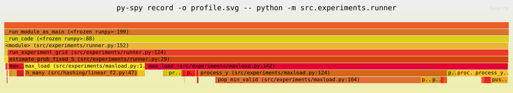

# Observing-Linear-Hashing

UE Projet STL (PSTL) - MU4IN508

Projet de recherche en deux parties autour des **fonctions de hachage linéaires** :

- **Part 1** : Étude des probabilités de queue du max-load pour le hachage linéaire sur F₂
- **Part 2** : Implémentation du schéma de multi-signatures MuSig2-H basé sur les fonctions de hachage linéaires (Tessaro & Zhu, EUROCRYPT 2023)

**Documentation détaillée (en chinois) :**

- [README_CN_SECTION1.md](README_CN_SECTION1.md) — Guide d'implémentation Part 1
- [README_CN_SECTION2.md](README_CN_SECTION2.md) — Guide d'implémentation Part 2
- [docs/part2_background.md](docs/part2_background.md) — Motivation de recherche et pont Part 1 → Part 2
- [docs/pari_thread_safety.md](docs/pari_thread_safety.md) — Analyse du problème de sécurité des threads PARI

---

## Structure du projet

```
Observing-Linear-Hashing/
├── Makefile                         # Point d'entrée unifié : make help pour la liste
├── src/
│   ├── hashing/                     # Part 1 : hachage linéaire sur F2
│   │   ├── linear_f2.py            #   Implémentation Python et C++
│   │   └── sampling.py             #   Générateurs de vecteurs aléatoires
│   ├── experiments/                 # Part 1 : expériences max-load
│   │   ├── runner.py               #   Point d'entrée principal des expériences
│   │   ├── maxload.py              #   Algorithme Space-Saving (Python)
│   │   └── mlShower.py             #   Affichage de la distribution du max-load
│   ├── crypto/                      # Part 2 : schéma multi-signatures MuSig2-H
│   │   ├── curve.py                #   Courbe elliptique Curve25519
│   │   ├── lhf.py                  #   Fonction de hachage linéaire Pedersen
│   │   ├── musig2h.py              #   8 algorithmes MuSig2-H + 3 hachages
│   │   ├── signer.py               #   Classe Signer (état d'un participant)
│   │   └── parallel_signing.py     #   Coordinateur de protocole (7 étapes)
│   └── cpp/                         # Part 1 : backend C++ (pybind11)
│       ├── linear_hash.hpp/cpp     #   Hachage linéaire F2 en C++
│       ├── trial_maxload.hpp/cpp   #   Un trial avec Space-Saving C++
│       ├── space_saving.hpp        #   Algorithme Space-Saving C++
│       ├── parallel_trials.hpp     #   Parallélisation via std::thread
│       ├── samplers.hpp            #   Génération de vecteurs aléatoires C++
│       ├── bindings.cpp            #   Bindings pybind11
│       └── CMakeLists.txt          #   Configuration CMake
├── tests/                           # Tests (Part 1 : 90, Part 2 : 82)
│   ├── conftest.py
│   ├── test_sampling.py            #   Distributions d'échantillonnage
│   ├── test_py.py                  #   Hachage Python
│   ├── test_cpp.py                 #   Module C++ fasthash
│   ├── test_curve.py               #   Courbe elliptique (21 tests)
│   ├── test_lhf.py                 #   Fonction de hachage linéaire (15 tests)
│   ├── test_musig2h.py             #   Schéma de signature (18 tests)
│   ├── test_signer.py              #   Classe Signer (14 tests)
│   ├── test_parallel.py            #   Coordinateur de protocole (9 tests)
│   └── example.py
├── docs/                            # Documentation
│   ├── part2_background.md         #   Contexte de recherche Part 2
│   └── pari_thread_safety.md       #   Analyse sécurité threads PARI
├── papers/                          # Références bibliographiques (PDF)
├── profiling/                       # Résultats de profilage (CPU/mémoire)
├── scripts/
│   ├── compare.py                  # Benchmark Python vs C++
│   └── profile_musig2h.py          # Profilage Part 2
├── data/                            # Résultats d'expériences
└── .gitignore
```

---

## Dépendances

```bash
# Part 1 : Python 3.13 + C++ (pybind11, CMake)
# Part 2 : SageMath 10.8 (brew install --cask sage)
```

## Commandes (Makefile)

Le projet utilise un `Makefile` comme point d'entrée unifié. Lancer `make help` pour la liste complète :

```bash
make help              # Afficher toutes les commandes disponibles
make build-cpp         # Compiler le backend C++ (pybind11, Python 3.13)
make test-part1        # Tests Part 1 (compile C++ automatiquement)
make test-part2        # Tests Part 2 (nécessite SageMath)
make test-all          # Tous les tests
make run-part1         # Lancer les expériences Part 1 (supporte ARGS)
make run-part2         # Lancer les expériences Part 2 (supporte ARGS)
make profile-part2     # Profilage Part 2 (benchmark + crash threads)
make profile-part2-cpu # Graphe d'appels CPU Part 2 (cProfile + gprof2dot)
make clean             # Nettoyer les artefacts de compilation
```

---

## Conventions de développement

### Principes généraux

La branche `main` est protégée, sans CI, sans validation obligatoire, avec fusion par **Rebase and merge** :

1. Il est interdit de pousser directement sur `main` (protection de branche activée) ;
2. Toutes les modifications passent par une branche personnelle, puis intégrées via Pull Request ;
3. La méthode de fusion est uniformément **Rebase and merge**.

### Référence rapide

```bash
# Démarrer une session
git checkout main && git pull origin main
git checkout dev-<nom> && git rebase main

# Développer et pousser
git add . && git commit -m "description du travail"
git push origin dev-<nom>

# Ouvrir une PR (dev → main), fusionner en Rebase and merge
```

---

# Part 1 : Probabilités de queue du max-load sur F₂

## Contexte théorique

On étudie les fonctions de hachage linéaires sur le corps fini F₂ = {0, 1} :

```
h(x) = M · x     (M : matrice aléatoire l×u sur F₂, opérations mod 2)
```

Le problème central est le modèle classique **« balls into bins »** : distribuer `m` données dans `2^l` bacs via la fonction de hachage, puis mesurer la charge maximale (max-load) :

```
M(S, h) = max_y |{x ∈ S : h(x) = y}|
```

L'expérience vérifie la borne théorique sur les probabilités de queue :

```
P[max-load ≥ r · log(n) / log(log(n))] ≈ 1/r²
```

**Conclusion** : les fonctions de hachage linéaires sur F₂ distribuent les données de manière suffisamment uniforme ; la décroissance des probabilités de queue est conforme à la prédiction théorique.

## Paramètres d'expérience

```bash
make run-part1                                          # Paramètres par défaut
make run-part1 ARGS="-u 3000 5000 -l 20 30 -t 10000"   # Personnalisé
make run-part1 ARGS="--backend py --no-plot"             # Changer de backend
make run-part1 ARGS="-h"                                 # Aide complète
```

| Paramètre   | Description                                   | Défaut                      |
| ----------- | --------------------------------------------- | --------------------------- |
| `-u`        | Valeurs de u (plusieurs possibles)            | 3000                        |
| `-l`        | Valeurs de l (plusieurs possibles)            | 30                          |
| `-r`        | Valeurs de r (plusieurs possibles)            | 2.0 2.3 2.6 2.9 3.2 3.5 4.0 |
| `-t`        | Nombre de trials                              | 5000                        |
| `-m`        | m_factor (m = m_factor × 2^l)                | 1.5                         |
| `-s`        | Graine aléatoire                              | 123                         |
| `-d`        | Type de distribution                          | uniform                     |
| `--backend` | Backend : `cpp` / `py` / `py-fixed`          | cpp                         |
| `--threads` | Nombre de threads C++                         | 10                          |
| `--no-plot` | Désactiver l'affichage graphique              | —                           |

## Algorithme d'estimation du max-load : Space-Saving

### Principe

Lorsque `l` est grand (par exemple `l=20`, soit un million de bacs), maintenir un comptage exact de chaque bac nécessite une mémoire `O(2^l)`, ce qui devient prohibitif. Le projet utilise l'algorithme **Space-Saving** pour estimer le max-load en mémoire `O(k)`.

On maintient une table de `k` candidats `table[y] = (c, e)`, où `c` est l'estimation du compteur et `e` la borne d'erreur, avec un **tas min paresseux** (lazy min-heap) pour retrouver le candidat de compteur minimal. Pour chaque identifiant de bac `y` traité :

- Si `y` est déjà dans la table : on incrémente son compteur `c` ;
- Si la table n'est pas pleine : on insère `y` avec `(c=1, e=0)` ;
- Si la table est pleine : on extrait le candidat de compteur minimal `y_min`, on le remplace par `y` en héritant de `c_min` comme erreur, nouveau compteur = `c_min + 1`.

### Complexité

- Temps : `O(N log k)` amorti, où `N` est la longueur du flux d'entrée
- Espace : `O(k)`

### Implémentation

- Version Python : `src/experiments/maxload.py` (classe `Maxload`, supporte le hachage unitaire et par batch)
- Version C++ : `src/cpp/space_saving.hpp` (classe `SpaceSaving`, compresse la sortie via fingerprint `uint64`)

## Analyse de performance — Part 1

### Méthodes de collecte

#### Flamegraph CPU (py-spy)

> **Note :** nécessite **Python 3.13**.

```bash
source .venv313/bin/activate
sudo py-spy record -o profiling/part1/profile.svg -- python -m src.experiments.runner
open profiling/part1/profile.svg
```

#### Flamegraph mémoire (memray)

```bash
python -m memray run -o profiling/part1/memray.bin -m src.experiments.runner
python -m memray flamegraph profiling/part1/memray.bin -o profiling/part1/memray-flamegraph.html
open profiling/part1/memray-flamegraph.html
```

### Résultats CPU

Flamegraph CPU collecté via `py-spy` (backend Python `py-fixed`, paramètres par défaut), 6 488 échantillons au total.



Chaîne d'appels : `runner.py:run_experiment_grid` → `estimate_prob_fixed_S` → `Maxload.max_load`. Répartition par fonction :

| Fonction               | Localisation              | Échantillons | Part            | Description                                           |
| ---------------------- | ------------------------- | ------------ | --------------- | ----------------------------------------------------- |
| `pop_min_valid`        | maxload.py:104            | 2 624        | **40.4%**       | Boucle `heappop` avec suppression paresseuse          |
| `h_many`               | linear_f2.py:47           | 1 449        | **22.3%**       | Hachage linéaire F₂ en batch                         |
| `process_y` (reste)    | maxload.py:109–131        | ~1 500       | ~23%            | Recherches dictionnaire, `push_state` (insertion tas) |
| `_chunked` + sampling  | maxload.py:41 / sampling.py | ~140       | ~2%             | Découpage du flux et génération aléatoire             |

**Observations clés :**

1. **Les opérations de tas Space-Saving constituent le principal goulot d'étranglement** (63%+, incluant `pop_min_valid` + `push_state`). La suppression paresseuse dans `pop_min_valid` provoque de nombreuses extractions invalides du tas — lorsque la table candidate est pleine, chaque remplacement nécessite des `heappop` répétées pour ignorer les entrées obsolètes, coûteux avec `k=50 000`.

2. **Le calcul de hachage ne représente que 22%**. `h_many` utilise l'interface batch du backend C++ (`hash_many_int`) via pybind11. Le goulot n'est pas la fonction de hachage elle-même.

3. **L'échantillonnage et le découpage sont négligeables** (~2%).

**Direction d'optimisation :** c'est la motivation de l'introduction du backend C++ `run_trials_maxload` — migrer l'intégralité de Space-Saving et du calcul de hachage en C++, éliminant le surcoût des opérations de tas Python, tout en exploitant `std::thread` pour paralléliser les trials.

### Résultats mémoire

Profilage mémoire collecté via `memray`, générant des flamegraphs HTML interactifs.

- **Flamegraph complet** : [memray-flamegraph.html](profiling/part1/memray-flamegraph-memray.html) (ouvrir dans le navigateur)
- **Paramètres spécifiques (u=200, l=20)** : [mem_u200_l20.html](profiling/part1/mem_u200_l20.html)

Sources principales de consommation mémoire :

1. **Phase d'échantillonnage `make_S`** : génère `m = m_factor × 2^l` vecteurs aléatoires stockés en liste. Pour `l=30, m_factor=1.5`, `m ≈ 1.6 × 10⁹` — la liste occupe une mémoire considérable. C'est le coût inhérent du mode `py-fixed` (S fixé).
2. **Table candidate Space-Saving** : dictionnaire `table` et liste `heap`, taille bornée par `k` (50 000 par défaut), mémoire contrôlable.
3. **Résultats batch `h_many`** : listes temporaires par chunk (`chunk_size=16 384`), libérées après utilisation.

Le mode `py` (S non fixé) utilise le générateur `make_S_iter` pour produire les échantillons en flux, évitant l'allocation de la liste `make_S`. Le backend C++ gère entièrement la mémoire côté C++.

### Comparaison Python vs C++

| Backend      | Description      | Temps par trial | Parallélisme           |
| ------------ | ---------------- | --------------- | ---------------------- |
| `py-fixed`   | Python, S fixé   | ~centaines ms   | Aucun                  |
| `py`         | Python, S en flux | ~centaines ms  | Aucun                  |
| `cpp`        | C++ intégral     | ~quelques ms    | `std::thread` multi-thread |

Le backend C++ implémente le hachage (`linear_hash.cpp`), Space-Saving (`space_saving.hpp`) et la boucle de trials (`trial_maxload.cpp`) entièrement en C++, avec parallélisation via `parallel_trials.hpp` utilisant `std::thread`. L'accélération typique est de l'ordre de **50–100x** par rapport au backend Python.

```bash
# Script de benchmark comparatif
python scripts/compare.py
```

### Tests Part 1 (90 tests)

```bash
make test-part1     # Exécute tous les tests Part 1 (compilation C++ automatique)
```

| Fichier              | Couverture                         |
| -------------------- | ---------------------------------- |
| `test_sampling.py`   | Distributions d'échantillonnage    |
| `test_py.py`         | Hachage Python                     |
| `test_cpp.py`        | Backend C++ (fasthash via pybind11) |

---

# Part 2 : Schéma de multi-signatures MuSig2-H

## Pont Part 1 → Part 2

Les deux parties étudient le **même objet mathématique** — la fonction de hachage linéaire — mais dans des structures algébriques et contextes applicatifs différents :

| | Part 1 | Part 2 |
|---|---|---|
| **Corps** | F₂ = {0, 1} | Z_p, p = 2²⁵⁵ − 19 |
| **Fonction** | h(x) = M·x (matrice binaire) | F(x₁,x₂) = x₁·G + x₂·Z (Pedersen) |
| **Espace d'entrée** | F₂^u | Z_q² |
| **Espace de sortie** | F₂^l | E(F_p) (courbe elliptique) |
| **Angle de recherche** | Propriétés statistiques | Application cryptographique |
| **Question clé** | La distribution est-elle uniforme ? | La signature peut-elle être falsifiée ? |
| **Résultat** | Probabilité de queue ≈ 1/r² | Sécurité prouvable sous hypothèse DL standard |

L'observation clé de TZ23 : le mappage de Schnorr `x → x·G` est lui-même une fonction de hachage linéaire (homomorphisme additif et scalaire). En l'abstrayant, on peut construire des schémas de signature dont la sécurité repose sur des hypothèses plus faibles que l'hypothèse OMDL utilisée par MuSig2.

## Contexte théorique

### Fonction de hachage linéaire (LHF) — Pedersen (TZ23 Section 5.1)

```
F : Z_q² → E(F_p)
F(x₁, x₂) = x₁·G + x₂·Z
```

où G est le point de base standard de Curve25519 et Z un générateur indépendant (paramètre transparent via hash-to-curve).

**Conditions de la Définition 1 :**

- F est un épimorphisme de S-modules ✓
- F n'est pas un monomorphisme (non-injectif) : le domaine Z_q² a q² éléments, l'image a au plus q éléments ✓
- |S|, |D|, |R| ≥ 2^κ ✓

### Pourquoi F(x) = x·G ne suffit pas

La multiplication scalaire simple `F(x) = x·G` (de Z_q vers le sous-groupe d'ordre premier) est bijective, violant la condition de non-monomorphisme. Il faut la construction Pedersen `F(x₁,x₂) = x₁·G + x₂·Z`.

## Vue d'ensemble MuSig2-H (TZ23 Fig. 4, ν=4)

### Huit algorithmes

| # | Algorithme      | Exécutant        | Fonction                                                         |
| - | --------------- | ---------------- | ---------------------------------------------------------------- |
| 1 | **Setup**       | Système          | Générer les paramètres communs `(p, E, G, Z)`                   |
| 2 | **KeyGen**      | Chaque signataire | Générer la paire de clés : `sk ← Z_q`, `pk = sk·G`            |
| 3 | **KeyAgg**      | Quiconque        | Entrée : liste de clés publiques `L`, sortie : `apk = Σ H_agg(L, pk_i)·pk_i` |
| 4 | **PreSign**     | Chaque signataire | Générer 4 paires de nonces `r_j ∈ Z_q²`, calculer `R_j = F(r_j)` |
| 5 | **PreAgg**      | Quiconque        | Agréger les nonces : `R_j = Σ_i R_{i,j}`                       |
| 6 | **Sign**        | Chaque signataire | Calculer la signature partielle `(R, s_i)` avec `sk`, `r_j`, message `m` |
| 7 | **SignAgg**     | Quiconque        | Agréger les signatures : `s = Σ s_i`, sortie `σ = (R, s)`      |
| 8 | **Ver**         | Quiconque        | Vérifier `F(s) == R + H_sig(apk, R, m)·apk`                    |

### Flux d'exécution

```
      ① KeyGen × n        ← parallélisable : chaque signataire indépendant
      ② KeyAgg            ← séquentiel : collecte de toutes les clés publiques
      ③ PreSign × n       ← parallélisable : génération de nonces indépendante
      ④ PreAgg            ← séquentiel : point de synchronisation 1
      ⑤ Sign × n          ← parallélisable : signatures partielles indépendantes
      ⑥ SignAgg           ← séquentiel : point de synchronisation 2
      ⑦ Ver               ← séquentiel : vérification
```

### Trois fonctions de hachage (séparation de domaines)

| Hachage                    | Entrée                               | Usage                                           |
| -------------------------- | ------------------------------------ | ------------------------------------------------ |
| `H_agg(L, pk)`            | Liste de clés + une clé publique     | Coefficients d'agrégation, protection rogue-key  |
| `H_non(apk, R_1..R_4, m)` | Clé agrégée + 4 nonces + message     | Combiner 4 nonces en 1                           |
| `H_sig(apk, R, m)`        | Clé agrégée + nonce agrégé + message | Valeur de défi Schnorr (Sign/Ver)                |

## Implémentation (5 modules)

### 1. Courbe elliptique — `src/crypto/curve.py`

Encapsulation Curve25519 (forme Montgomery) basée sur SageMath :
- Corps fini `Fp = GF(p)`, p = 2²⁵⁵ − 19
- Courbe `E: y² = x³ + 486662x² + x` sur Fp
- Point de base `G` (x=9, projeté dans le sous-groupe d'ordre premier via ×cofacteur 8)
- Générateur indépendant `Z` (hash-to-curve transparent, tag `"Curve25519-Pedersen-Z"`)
- Outils : `scalar_mult(k, P)`, `point_add(P, Q)`, `random_scalar(rng)`

### 2. Fonction de hachage linéaire Pedersen — `src/crypto/lhf.py`

```
F(x₁, x₂) = x₁·G + x₂·Z
F_key(sk)  = F(sk, 0) = sk·G    (bijectif sur D_key)
```

Vérifie les 3 conditions de la Définition 1 : épimorphisme de S-modules, non-monomorphisme, condition de taille.

### 3. MuSig2-H — `src/crypto/musig2h.py`

Les 8 algorithmes (Fig. 4, ν=4) + 3 fonctions de hachage à séparation de domaines (SHA-256 avec préfixes `0x01`, `0x02`, `0x03`).

### 4. Classe Signer — `src/crypto/signer.py`

Encapsulation de l'état d'un signataire MuSig2-H :
- **Encapsulation légère** : appelle les fonctions sans état de `musig2h.py`
- **Protection anti-mauvais usage** : erreur explicite si les étapes sont appelées dans le désordre
- **Nonces à usage unique** : destruction automatique après signature (`self._st = None`)

### 5. Coordinateur de protocole — `src/crypto/parallel_signing.py`

Orchestre `n` signataires à travers les 7 étapes du protocole, avec chronométrage par phase.

```bash
sage -python -m src.crypto.parallel_signing              # Défaut (3 signataires)
sage -python -m src.crypto.parallel_signing -n 5         # 5 signataires
sage -python -m src.crypto.parallel_signing -n 10 -m 'vote yes' -s 0  # Personnalisé
```

## Analyse de performance — Part 2

Scripts de profilage : `scripts/profile_musig2h.py`

```bash
make profile-part2       # Exécution complète (avec expérience de crash, ~3 min)
make profile-part2-fast  # Exécution rapide (sans crash)
make profile-part2-cpu   # Graphe d'appels CPU (cProfile + gprof2dot)
```

### Expérience A : Reproduction du crash multi-thread

Vérification du problème de sécurité des threads PARI via `ThreadPoolExecutor` :

| signataires | threads | répétitions | crashs | taux | Erreur                                     |
| ----------- | ------- | ----------- | ------ | ---- | ------------------------------------------ |
| 2           | 2       | 5           | 5      | 100% | cysignals.SignalError: Segmentation fault   |
| 4           | 4       | 5           | 5      | 100% | cysignals.SignalError: Segmentation fault   |
| 8           | 8       | 5           | 5      | 100% | cysignals.SignalError: Segmentation fault   |

Chaîne d'appels : `Signer.__init__` → `keygen` → `F_key` → `scalar_mult` → `pari.ellmul` → **SIGSEGV**

### Expérience B : Extensibilité séquentielle

Temps médian par phase (ms) selon le nombre de signataires :

| n  | keygen | keyagg | presign | preagg | sign  | signagg | verify | total |
| -- | ------ | ------ | ------- | ------ | ----- | ------- | ------ | ----- |
| 1  | 0.6    | 0.6    | 4.6     | 0.0    | 2.2   | 0.0     | 1.7    | 9.6   |
| 5  | 2.8    | 2.9    | 22.0    | 0.2    | 22.8  | 0.0     | 1.7    | 52.2  |
| 10 | 5.6    | 5.8    | 44.1    | 0.4    | 75.3  | 0.0     | 1.7    | 132.8 |
| 20 | 11.0   | 12.0   | 87.7    | 0.7    | 270.6 | 0.0     | 1.6    | 383.6 |

Les phases parallélisables (keygen, presign, sign) croissent linéairement avec n ; les phases séquentielles (verify, signagg) restent quasi constantes.

### Expérience C : Décomposition par phases

| n  | T_parallel | T_sequential | T_total | parallel% |
| -- | ---------- | ------------ | ------- | --------- |
| 1  | 7.3ms      | 2.2ms        | 9.6ms   | 76.4%     |
| 5  | 47.5ms     | 4.7ms        | 52.2ms  | 91.0%     |
| 10 | 125.0ms    | 7.9ms        | 132.8ms | 94.1%     |
| 20 | 369.4ms    | 14.4ms       | 383.6ms | 96.3%     |

La fraction parallélisable passe de 76% à 96% — le potentiel de parallélisation augmente, mais les limitations de PARI empêchent sa réalisation.

### Expérience D : Loi d'Amdahl — accélération théorique

Selon la loi d'Amdahl [^amdahl] : `S(n) = 1 / ((1 − f) + f / n)`, avec f = 96.3% (mesuré à n=20) :

| workers | Accélération théorique | Accélération réelle | Perte   |
| ------- | ---------------------- | ------------------- | ------- |
| 2       | 1.93x                 | 1.00x               | 0.93x   |
| 4       | 3.60x                 | 1.00x               | 2.60x   |
| 8       | 6.35x                 | 1.00x               | 5.35x   |
| 16      | 10.28x                | 1.00x               | 9.28x   |
| 32      | 14.88x                | 1.00x               | 13.88x  |

### Graphe d'appels CPU


Collecté via `cProfile` + `gprof2dot`. Résultat : **`_acted_upon_` (PARI `ellmul`, multiplication scalaire) consomme 90.4% du temps CPU**. C'est exactement le point chaud de la contention de la pile globale PARI.

### Extensibilité et visualisation Amdahl


### Tests Part 2 (82 tests)

```bash
make test-part2     # Exécute tous les tests Part 2
```

| Fichier              | Tests | Couverture                                        |
| -------------------- | ----- | ------------------------------------------------- |
| `test_curve.py`      | 21    | Corps premier, ordre de courbe, sous-groupe, arithmétique |
| `test_lhf.py`        | 15    | Linéarité, épimorphisme, non-injectivité          |
| `test_musig2h.py`    | 18    | 8 algorithmes + protocole 1/2/3/5 signataires + sécurité |
| `test_signer.py`     | 14    | Cycle de vie Signer, sécurité des nonces, erreurs d'ordre |
| `test_parallel.py`   | 9     | Coordinateur, structure de retour, reproductibilité |

---

## Parallélisation et sécurité des threads PARI

### Parallélisme au niveau du protocole

Le protocole MuSig2-H supporte naturellement le parallélisme — les étapes ①③⑤ sont exécutées indépendamment par chaque signataire, avec synchronisation uniquement aux étapes ④ (PreAgg) et ⑥ (SignAgg). C'est ce que l'enseignant désigne comme « processus parallèles » au tableau, visant à économiser les tours de communication.

### Problème au niveau de l'implémentation

L'utilisation de `ThreadPoolExecutor` pour paralléliser les étapes ①③⑤ provoque **100% de segmentation faults**.

**Cause fondamentale** : SageMath utilise la bibliothèque PARI/GP pour les opérations sur les courbes elliptiques. PARI utilise une **pile globale unique par processus** pour l'allocation mémoire temporaire, **sans aucune protection par verrou**. Lorsque `cypari2` libère le GIL avant d'appeler les fonctions C de PARI, plusieurs threads exécutent réellement du code C en parallèle sur des cœurs CPU différents, provoquant des écritures concurrentes sur la même pile globale.

`ProcessPoolExecutor` (multi-processus) éviterait le problème de mémoire partagée, mais les objets de points de courbe SageMath contiennent des références complexes aux structures algébriques internes et ne sont pas sérialisables via `pickle`.

**Analyse détaillée** : voir [docs/pari_thread_safety.md](docs/pari_thread_safety.md).

### Solution actuelle

Les étapes parallélisables sont exécutées **séquentiellement**, avec des commentaires dans le code marquant clairement la parallélisabilité. Ceci reflète fidèlement la conception du protocole.

Pour une exécution véritablement parallèle : C++ avec la bibliothèque RELIC (thread-safe), ou multi-processus avec sérialisation manuelle (coordonnées entières des points).

---

## Références

- **[TZ23]** Tessaro & Zhu, *"Threshold and Multi-Signature Schemes from Linear Hash Functions"*, EUROCRYPT 2023
- **[MuSig2]** Nick, Ruffing & Seurin, *"MuSig2: Simple Two-Round Schnorr Multi-Signatures"*, CRYPTO 2021
- **[Curve25519]** Bernstein, 2006, p = 2²⁵⁵ − 19

[^amdahl]: G. M. Amdahl, "Validity of the Single Processor Approach to Achieving Large Scale Computing Capabilities", *AFIPS Conference Proceedings*, 1967, pp. 483–485.
