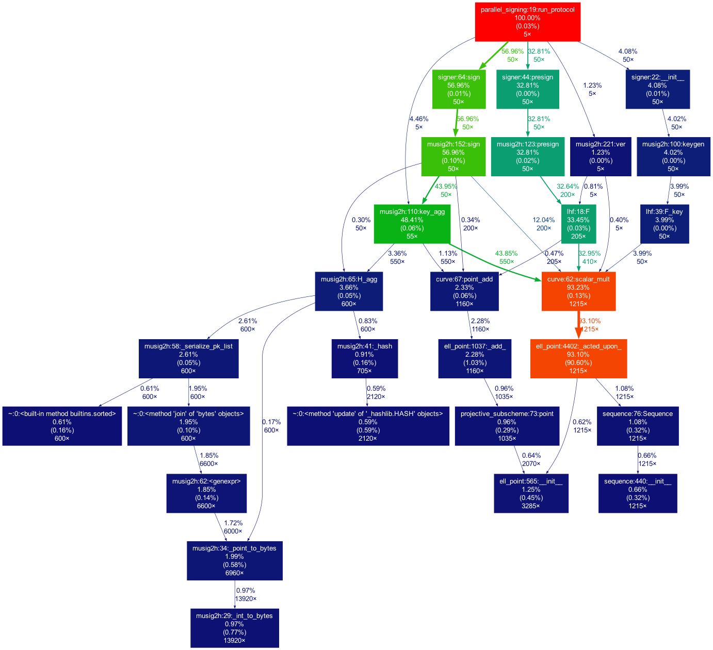
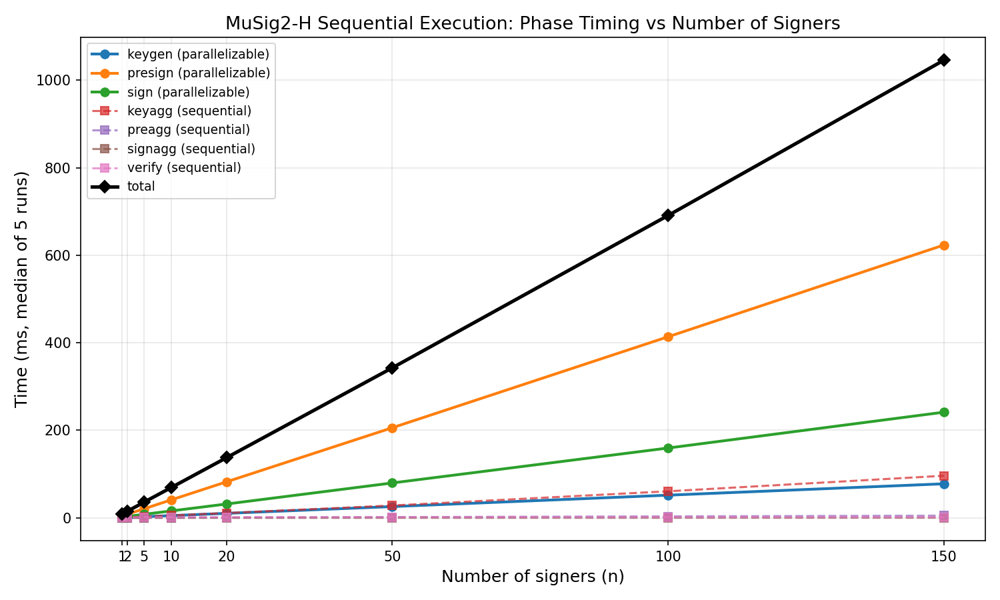
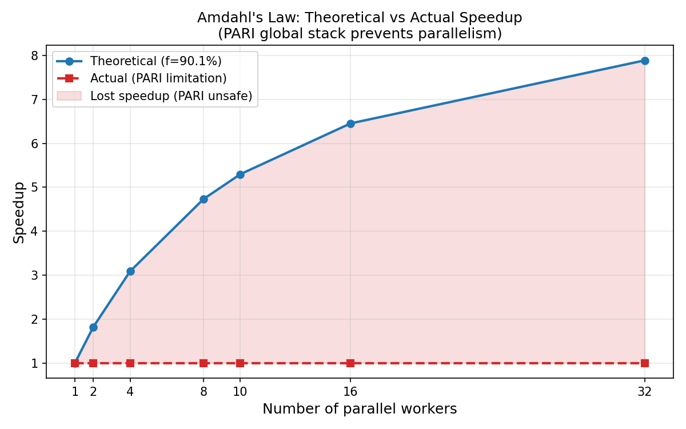

# Part 2：基于线性哈希函数的多签方案 MuSig2-H

## 概述

基于 Tessaro & Zhu (EUROCRYPT 2023) 论文，使用 Pedersen 线性哈希函数实例化 MuSig2-H 多签方案。

**相关文档：**

- [Part 2 背景手册](docs/part2_background.md) — 研究动机、Part 1 到 Part 2 的桥梁、MuSig2 vs MuSig2-H 对比
- [PARI 线程安全问题分析](docs/pari_thread_safety.md) — 并行化过程中遇到的 SageMath/PARI 底层问题及解决方案

## 环境依赖

- **SageMath 10.8**（`brew install --cask sage`）
- Part 2 所有代码通过 `sage -python` 运行

## MuSig2-H 方案总览（TZ23 Fig. 4, v=4）

### 八个算法

| # | 算法              | 执行者     | 功能                                                                                                     |
| - | ----------------- | ---------- | -------------------------------------------------------------------------------------------------------- |
| 1 | **Setup**   | 系统       | 生成公共参数 `(p, E, G, Z)`，所有人共享                                                                |
| 2 | **KeyGen**  | 每个签名者 | 生成密钥对：`sk <- Z_q`，`pk = sk*G`                                                                 |
| 3 | **KeyAgg**  | 任何人     | 输入公钥列表 `L`，输出聚合公钥 `apk = Sum H_agg(L, pk_i)*pk_i`                                       |
| 4 | **PreSign** | 每个签名者 | 生成 4 个随机 nonce 对 `r_j in Z_q^2`，计算 `R_j = F(r_j)`，公开 `(R_1..R_4)`，保密 `(r_1..r_4)` |
| 5 | **PreAgg**  | 任何人     | 聚合所有签名者的 nonce：`R_j = Sum_i R_{i,j}`，得到 `(R_1..R_4)`                                     |
| 6 | **Sign**    | 每个签名者 | 用私钥 `sk`、保密的 `r_j`、聚合 nonce、消息 `m`，计算部分签名 `(R, s_i)`                         |
| 7 | **SignAgg** | 任何人     | 聚合部分签名：`s = Sum s_i`，输出最终签名 `sigma = (R, s)`                                           |
| 8 | **Ver**     | 任何人     | 验证 `F(s) == R + H_sig(apk, R, m)*apk`                                                                |

### 执行流程

```
      ① KeyGen × n        ← 可并行：每人独立生成密钥
      ② KeyAgg            ← 顺序：收集所有公钥后聚合
      ③ PreSign × n       ← 可并行：每人独立生成 nonce
      ④ PreAgg            ← 顺序：同步点 1，聚合 nonce
      ⑤ Sign × n          ← 可并行：每人独立算部分签名
      ⑥ SignAgg           ← 顺序：同步点 2，聚合签名
      ⑦ Ver               ← 顺序：验证
```

### 三个哈希函数（域分离）

| 哈希                        | 输入                            | 用途                                       |
| --------------------------- | ------------------------------- | ------------------------------------------ |
| `H_agg(L, pk)`            | 公钥列表 + 单个公钥             | KeyAgg 中计算聚合系数，防止 rogue-key 攻击 |
| `H_non(apk, R_1..R_4, m)` | 聚合公钥 + 4 个 nonce 点 + 消息 | Sign 中将 4 个 nonce 合并为 1 个           |
| `H_sig(apk, R, m)`        | 聚合公钥 + 聚合 nonce + 消息    | Sign/Ver 中的 Schnorr 挑战值               |

---

## 实现进度

### 1. 椭圆曲线封装 — `src/crypto/curve.py`

Curve25519（Montgomery 形式）封装，基于 SageMath。

**提供：**

- 有限域 `Fp = GF(p)`，`p = 2^255 - 19`
- 曲线 `E: y^2 = x^3 + 486662x^2 + x` over `Fp`
- 基点 `G`（标准基点 x=9，乘 cofactor 8 投影到素数阶子群）
- 独立生成元 `Z`（透明 hash-to-curve，标签 `"Curve25519-Pedersen-Z"`）
- 素数阶子群阶 `q`（`|E| = 8q`，`q` 为素数）
- 工具函数：`scalar_mult(k, P)`、`point_add(P, Q)`、`random_scalar(rng)`

**设计要点：**

- G 和 Z 均乘以 cofactor 8，确保在素数阶子群中（阶为 q）
- Z 通过 `SHA-256("Curve25519-Pedersen-Z:{counter}")` 生成，透明且确定性
- `random_scalar` 支持传入 `random.Random` 实例以保证可复现

**测试：**

```bash
sage -python -m pytest tests/test_curve.py -v
```

覆盖：素数性质、曲线阶、子群阶、G/Z 性质、点加交换律/结合律/分配律、逆元、单位元、随机标量范围与确定性。

### 2. Pedersen 线性哈希函数 — `src/crypto/lhf.py`

实现 TZ23 Section 5.1 的 DL 实例化。

**定义：**

```
F : Z_q^2 -> E(F_p)
F(x1, x2) = x1*G + x2*Z
```

**提供：**

- `F(x1, x2)` — 核心函数，返回曲线点
- `F_vec((x1, x2))` — 向量形式接口
- `F_key(sk)` — 密钥空间限制 `F(sk, 0) = sk*G`，此时 F 为双射

**验证 Definition 1 的三个条件：**

1. **S-模满同态**：G = F(1,0)，Z = F(0,1)，任意群元素可由 G、Z 线性组合生成
2. **非单射**：定义域 Z_q^2 有 q^2 个元素，像 E[q] 最多 q 个元素（鸽巢原理）
3. **规模条件**：|S| = |Z_q| = q 约 2^252，|D| = q^2，|R| = q，均 >= 2^kappa

**测试：**

```bash
sage -python -m pytest tests/test_lhf.py -v
```

覆盖：线性性（加法同态、标量同态、随机测试）、满同态性、非单射性、F_vec/F_key 接口、D_key 上的双射性。

### 3. MuSig2-H 方案 — `src/crypto/musig2h.py`

实现 TZ23 Fig. 4 的全部 8 个算法（v=4）。

**算法实现：**

| 函数                            | 对应算法 | 说明                                                        |
| ------------------------------- | -------- | ----------------------------------------------------------- |
| `setup()`                     | Setup    | 返回公共参数 `(p, G, Z, q)`                               |
| `keygen(rng)`                 | KeyGen   | `sk <- Z_q`, `pk = sk*G`                                |
| `key_agg(L)`                  | KeyAgg   | `apk = Sum H_agg(L, pk_i)*pk_i`                           |
| `presign(rng)`                | PreSign  | 生成 4 个 nonce 对 `r_j in Z_q^2` 和承诺 `R_j = F(r_j)` |
| `preagg(pp_list)`             | PreAgg   | 按分量聚合 nonce：`R_j = Sum_i R_{i,j}`                   |
| `sign(st, app, sk, pk, m, L)` | Sign     | 计算部分签名 `(R, s)`                                     |
| `sign_agg(out_list)`          | SignAgg  | 聚合部分签名，验证 R 一致性                                 |
| `ver(apk, m, sigma)`          | Ver      | 验证 `F(s) == R + c*apk`                                  |

**三个域分离哈希函数：**

- `H_agg(L, pk)` — `SHA-256(0x01 || L_sorted || pk) mod q`
- `H_non(apk, nonces, m)` — `SHA-256(0x02 || apk || R_1..R_4 || m) mod q`
- `H_sig(apk, R, m)` — `SHA-256(0x03 || apk || R || m) mod q`

公钥列表在哈希前按坐标排序，确保确定性。

**Sign 中的关键计算：**

```
b = H_non(apk, (R_1,...,R_4), m)
R = Sum_{j=1}^{4} b^{j-1} * R_j          （曲线点运算）
c = H_sig(apk, R, m)
s = Sum_{j=1}^{4} b^{j-1} * r_j + c*a*(sk, 0)   （Z_q^2 上运算）
```

其中 `s = (s0, s1)` 是 Z_q^2 中的标量对，`(sk, 0)` 是 D_key 中的元素。

**测试：**

```bash
sage -python -m pytest tests/test_musig2h.py -v
```

覆盖：Setup/KeyGen 基本性质、KeyAgg 确定性、PreSign 一致性、PreAgg 正确性、哈希函数域分离、1/2/3/5 人完整协议验证、错误消息/公钥/签名篡改检测、R 不一致拒绝。

### 4. 签名者封装 — `src/crypto/signer.py`

将单个 MuSig2-H 签名参与者的状态和流程封装为 `Signer` 类。

**设计原则：**

- **薄封装**：内部调用 `musig2h.py` 的无状态函数，不复制任何密码学计算逻辑
- **状态管理**：持有私钥、公钥、nonce 秘密、聚合承诺等状态
- **防误用**：跳步骤调用会抛出 `RuntimeError`，明确提示缺少哪一步
- **nonce 一次性**：签名后自动销毁 nonce 秘密（`self._st = None`），防止复用泄露私钥

**生命周期：**

```
Signer(seed)              # 构造时自动 KeyGen，持有私钥和公钥
  -> set_peers(other_pks) # 告知队友公钥
  -> presign()            # 生成 nonce，返回公开承诺
  -> receive_agg_nonce()  # 接收聚合承诺
  -> sign(message)        # 计算部分签名，nonce 自动销毁
（如需再次签名，从 presign 重新开始）
```

**内部状态：**

| 属性       | 类型         | 何时设置              | 说明                     |
| ---------- | ------------ | --------------------- | ------------------------ |
| `sk`     | 标量         | 构造时                | 私钥，永久保密           |
| `pk`     | 曲线点       | 构造时                | 公钥，公开               |
| `_peers` | 曲线点列表   | `set_peers`         | 其他签名者的公钥         |
| `_st`    | nonce 对元组 | `presign`           | 保密的随机数，签名后销毁 |
| `_pp`    | 曲线点元组   | `presign`           | 公开的 nonce 承诺        |
| `_app`   | 曲线点元组   | `receive_agg_nonce` | 聚合后的 nonce 承诺      |

**测试：**

```bash
sage -python -m pytest tests/test_signer.py -v
```

覆盖：KeyGen 确定性与区分性、1/2/3/5 人完整协议验证、nonce 销毁与重签、跳步骤报错（4 种错误路径）。

### 5. 协议协调器 — `src/crypto/parallel_signing.py`

编排 n 个 Signer 走完整个协议，展示两阶段并行结构并计时。

**核心函数 `run_protocol(n_signers, message, seed)`：**

```
① KeyGen x n        <- 可并行：每人独立生成密钥
② KeyAgg            <- 顺序：收集所有公钥后聚合
③ PreSign x n       <- 可并行：每人独立生成 nonce
④ PreAgg            <- 顺序：同步点 1，聚合 nonce
⑤ Sign x n          <- 可并行：每人独立算部分签名
⑥ SignAgg           <- 顺序：同步点 2，聚合签名
⑦ Ver               <- 顺序：验证
```

**返回字典包含：**

- `sigma` — 最终签名 `(R, (s0, s1))`
- `apk` — 聚合公钥
- `verified` — 验证结果
- `timing` — 各阶段耗时（keygen, keyagg, presign, preagg, sign, signagg, verify, total）

**可直接作为脚本运行（支持命令行参数）：**

```bash
sage -python -m src.crypto.parallel_signing              # 默认参数（3 人）
sage -python -m src.crypto.parallel_signing -n 5         # 5 人签名
sage -python -m src.crypto.parallel_signing -n 10 -m 'vote yes' -s 0  # 自定义全部参数
sage -python -m src.crypto.parallel_signing -h           # 查看帮助
```

| 参数 | 说明 | 默认值 |
|------|------|--------|
| `-n` / `--n-signers` | 签名者数量 | 3 |
| `-m` / `--message` | 待签消息 | `Hello MuSig2-H` |
| `-s` / `--seed` | 随机种子 | 42 |

输出示例：

```
=== MuSig2-H 并行签名模拟 ===
签名者数量：3
消息：b'Hello MuSig2-H'
随机种子：42

[keygen  ]  3 人（可并行）   ... 0.002s
[keyagg  ]  聚合公钥         ... 0.002s
[presign ]  3 人（可并行）   ... 0.013s
[preagg  ]  聚合 nonce       ... 0.000s
[sign    ]  3 人（可并行）   ... 0.010s
[signagg ]  聚合签名         ... 0.000s
[verify  ]  验证             ... 0.002s

验证结果：通过
总耗时：0.027s
```

**测试：**

```bash
sage -python -m pytest tests/test_parallel.py -v
```

覆盖：1/2/3/5 人正确性、返回结构完整性、同种子可复现、错误消息验证失败。

---

## 并行化与 PARI 线程安全问题

### 协议层面的并行性

MuSig2-H 协议天然支持并行——步骤 ①③⑤ 中每个签名者独立执行，互不依赖，只需在步骤 ④（PreAgg）和 ⑥（SignAgg）进行同步。这是老师板书中强调的"processus paralleles"，目的是节省通信轮次（economiser comm.）。

### 实现层面遇到的问题

我们最初使用 Python 的 `ThreadPoolExecutor` 将步骤 ①③⑤ 提交给线程池并发执行，但 **100% 触发段错误（Segmentation fault）**。

根本原因：SageMath 的椭圆曲线运算底层依赖 **PARI/GP 库**，PARI 使用一个进程唯一的**全局栈**分配临时内存，且**没有任何锁保护**。当多个线程同时执行标量乘法时，并发写入全局栈导致内存损坏。

Python 的 GIL 无法防止此问题——`cypari2` 在调用 PARI 的 C 函数前会释放 GIL（标准做法，避免阻塞其他线程），释放后多个线程的 C 代码在多核 CPU 上真正并行执行，PARI 全局栈就被并发读写了。

`ProcessPoolExecutor`（多进程）理论上可避免共享内存问题，但 SageMath 的曲线点对象包含对内部环结构的复杂引用，无法通过 `pickle` 序列化跨进程传输。

**详细的崩溃调用链、原因分析和替代方案见 [docs/pari_thread_safety.md](docs/pari_thread_safety.md)。**

### 当前方案

Python 实现中，可并行的步骤以**顺序执行模拟**，代码结构和注释清楚标注了并行性。

为实现真正的多线程并行，我们启动了 **C++ RELIC 并行后端**（见下方）。

---

## C++ 并行后端（RELIC + pybind11）

### 动机

PARI 线程不安全（100% segfault）、SageMath 对象无法跨进程序列化——Python 层面无解。
方案：用 **RELIC 密码学库**（线程安全，每线程 `core_init()`）+ `std::thread` 重写椭圆曲线运算，通过 pybind11 暴露 `fastmusig` Python 模块。

**详细技术设计文档：[docs/cpp_relic_parallel_design.md](docs/cpp_relic_parallel_design.md)**

### 实现进度

#### Phase 1：基础层 ✅

椭圆曲线封装和域分离哈希函数，已通过 34 个交叉验证测试。

**源码文件（`src/cpp_musig/`）：**

| 文件 | 说明 |
|------|------|
| `CMakeLists.txt` | 构建配置：FetchContent 拉取 RELIC、pybind11（Python 3.13）、OpenSSL 3 |
| `curve25519.hpp/.cpp` | Scalar/Point 类、G/Z 计算、Montgomery ↔ Weierstrass 坐标转换 |
| `hash_utils.hpp/.cpp` | SHA256 域分离哈希：H_agg(tag=1)、H_non(tag=2)、H_sig(tag=3) |
| `bindings.cpp` | pybind11 模块 `fastmusig`，导出常量和哈希函数 |

**关键技术点：**

- **曲线表示**：RELIC 内部使用 Short Weierstrass 形式，序列化时转回 Montgomery 坐标，确保与 Python 哈希输出字节级一致
- **坐标转换**：`x_w = x_m + A/3 mod p`（Montgomery → Weierstrass），`x_m = x_w - A/3 mod p`（反向），y 坐标不变
- **基点计算**：G 从 Montgomery x=9 lift，Z 通过 hash-to-curve 生成，均乘 cofactor 8（使用显式 Weierstrass 点倍加公式，避免曲线未设置时的 `ep_mul` 依赖）
- **字节序**：hash-to-curve 用 little-endian，H_agg/H_non/H_sig 用 big-endian，点序列化用 big-endian

**预计算常量（`curve25519.cpp`，均为十六进制）：**

| 常量 | 值 | 含义 |
|------|----|------|
| `P_STR` | `2^255 - 19` | 有限域模数 p，定义 F_p |
| `A_MONT` | `486662`（`0x76D06`） | Montgomery 曲线系数 A，即 `y² = x³ + Ax² + x` |
| `Q_STR` | `2^252 + 2774...8493` | 素数阶子群阶 q，曲线总阶 = 8q（cofactor = 8） |
| `A_DIV_3` | `A × 3⁻¹ mod p` | 坐标转换常量，486662/3 在整数上不整除，但模 p 下 3 有逆元 |
| `A_W` | `(3 - A²)/3 mod p` | Weierstrass 系数 a_w，由 Montgomery A 推导 |
| `B_W` | `(2A³ - 9A)/27 mod p` | Weierstrass 系数 b_w，使 RELIC 能原生运算 Curve25519 |

**交叉验证结果：**

| 验证项 | 结果 |
|--------|------|
| G 坐标（Montgomery 64 bytes） | C++ == Python ✅ |
| Z 坐标（Montgomery 64 bytes） | C++ == Python ✅ |
| q 值（big-endian 32 bytes） | C++ == Python ✅ |
| H_agg 输出（固定输入） | C++ == Python ✅ |
| H_non 输出（固定输入） | C++ == Python ✅ |
| H_sig 输出（固定输入） | C++ == Python ✅ |
| pk list 排序序列化 | C++ == Python ✅ |

#### Phase 2：算法层 ✅

8 个 MuSig2-H 算法 + Signer 状态机 + 交叉签名验证，已通过 24 个新增测试（共 58 个）。

**新增源码文件（`src/cpp_musig/`）：**

| 文件 | 说明 |
|------|------|
| `musig2h.hpp/.cpp` | 8 个无状态算法：keygen、key_agg、key_agg_ex、presign、preagg、sign、sign_agg、ver |
| `signer.hpp/.cpp` | Signer 状态机：生命周期管理、nonce 签名后自动销毁、`std::optional` 状态控制 |

**关键设计点：**

- **全局缓存优化**：`key_agg_ex` 一次性计算 `apk` 和所有签名者的聚合系数 `coeffs`，通过 `set_agg_key(apk, a)` 分发缓存到每个 Signer，`sign()` 时跳过重复的 `key_agg` 和 `H_agg` 计算（与 Python 版 `parallel_signing.py` 策略一致）
- **sign() 可选缓存参数**：接受 `cached_apk`/`cached_a` 指针，有缓存直接使用，无缓存回退到重算
- **Signer 状态机**：每个 Signer 持有独立 RNG（`uint64_t` seed），为 Phase 3 线程安全做准备
- **run_protocol_sequential**：C++ 内完整 7 步协议（与 Python `parallel_signing.py` 流程一致），作为 Phase 3 并行化基线

**交叉验证结果（24 个新增测试）：**

| 验证项 | 结果 |
|--------|------|
| KeyAgg apk 一致性（2 点 / 单点 / 顺序无关） | C++ == Python ✅ |
| key_agg_ex 系数一致性（3 个生成密钥） | C++ == Python ✅ |
| Python 签名 → C++ ver（2/3/5 签名者） | 验证通过 ✅ |
| C++ ver 拒绝篡改（wrong msg / s0 / s1） | 正确拒绝 ✅ |
| C++ run_protocol_sequential 自验（1/2/3/5/10 签名者） | 验证通过 ✅ |
| C++ 签名 → Python ver（2/3/5/10 签名者） | 验证通过 ✅ |

#### Phase 3：并行层 ✅

RelicThreadPool 线程池 + `run_protocol_parallel` 并行协议，已通过 18 个新增测试（共 76 个）。

**新增源码文件（`src/cpp_musig/`）：**

| 文件 | 说明 |
|------|------|
| `parallel_protocol.hpp/.cpp` | RelicThreadPool 线程池 + `run_protocol_parallel` 7步并行协议 |

**RelicThreadPool 设计（设计文档 Section 9）：**

```
pool = RelicThreadPool(n_threads)    ← 线程启动，各调 core_init() + 曲线参数设置（1次）
  ├── Phase 1: pool.run_phase(n, KeyGen)    → barrier
  ├── Phase 3: pool.run_phase(n, PreSign)   → barrier
  └── Phase 5: pool.run_phase(n, Sign)      → barrier
~pool()                                      ← 线程退出，各调 core_clean()（1次）
```

- **线程池常驻**：3 个并行阶段复用同一批 worker 线程，只需 1×N 次 `core_init()/core_clean()`（而非 spawn-per-phase 的 3×N 次）
- **任务分发**：`std::atomic<size_t>` 原子计数器，worker 通过 `fetch_add` 抢占任务索引
- **阶段同步**：`phase_id_` 递增 + `condition_variable` 通知启动，`workers_done_` 原子计数到达阈值后通知完成
- **GIL 释放**：pybind11 绑定中 `py::gil_scoped_release`，C++ 并行执行期间不持有 Python GIL
- **线程数上限**：`min(num_threads, n_signers)`，避免空闲线程浪费

**RELIC 线程安全修复：**

`curve_init_thread()` 不仅调用 `core_init()`，还调用 `setup_curve_params_for_thread()` 设置线程局部的素域参数（`fp_prime_set_dense`）和曲线方程（`ep_curve_set_plain`），因为 RELIC 的曲线参数是 thread-local 的。

**交叉验证结果（18 个新增测试）：**

| 验证项 | 结果 |
|--------|------|
| 并行协议自验（1/2/3/5/10/50 签名者） | 验证通过 ✅ |
| 确定性：同 seed 两次并行结果一致 | 一致 ✅ |
| 不同 seed 产生不同签名 | 不同 ✅ |
| **并行 == 顺序**（同 seed → 相同 R/s0/s1/apk） | 完全一致 ✅ |
| C++ 并行签名 → Python ver（3/5/10 签名者） | 验证通过 ✅ |
| 线程边界（num_threads=1 / threads>signers） | 正确处理 ✅ |
| 空消息 / 10KB 消息 | 验证通过 ✅ |
| timing dict 包含 8 个阶段 key | 结构正确 ✅ |
| result 字段和字节长度 | 格式正确 ✅ |

#### Phase 4：集成（待实现）

bench-part2 基准测试 + 文档更新。

### 构建与测试

```bash
# 依赖
# - CMake >= 3.16
# - C++17 编译器
# - OpenSSL 3（brew install openssl@3）
# - pybind11（pip install pybind11）
# - RELIC（CMake FetchContent 自动拉取，无需手动安装）
# - Python 3.13（.venv313）

# 构建 C++ 后端
make build-musig

# 运行交叉验证测试（76 tests，需要 SageMath）
make test-part2-cpp

# 手动构建（等价于 make build-musig）
cmake -S src/cpp_musig -B src/cpp_musig/build -DCMAKE_BUILD_TYPE=Release
cmake --build src/cpp_musig/build -j
```

构建产物：`fastmusig.cpython-313-darwin.so`（项目根目录）

### 当前导出的 Python API

```python
import fastmusig

# Phase 1: 常量与哈希
fastmusig.init()                          # 初始化曲线参数
fastmusig.get_G_bytes() -> bytes          # G 点，Montgomery x||y，64 bytes
fastmusig.get_Z_bytes() -> bytes          # Z 点，Montgomery x||y，64 bytes
fastmusig.get_q_bytes() -> bytes          # 子群阶 q，big-endian，32 bytes
fastmusig.H_agg_bytes(L, pk) -> bytes     # H_agg 哈希，32 bytes
fastmusig.H_sig_bytes(apk, R, m) -> bytes # H_sig 哈希，32 bytes
fastmusig.H_non_bytes(apk, nonces, m) -> bytes  # H_non 哈希，32 bytes

# Phase 2: 算法与协议
fastmusig.keygen(seed) -> (sk_bytes, pk_bytes)              # KeyGen
fastmusig.key_agg(pk_list_bytes) -> apk_bytes               # KeyAgg
fastmusig.key_agg_ex(pk_list_bytes) -> (apk_bytes, [coeff_bytes...])  # KeyAgg + 系数
fastmusig.ver(apk_bytes, msg, R_bytes, s0_bytes, s1_bytes) -> bool    # 签名验证
fastmusig.run_protocol_sequential(n_signers, msg, seed=42) -> dict    # 完整顺序协议

# Phase 3: 并行协议
fastmusig.run_protocol_parallel(n_signers, msg, seed=42, num_threads=0) -> dict
# num_threads=0 自动使用 hardware_concurrency
# 返回 dict 包含: apk, R, s0, s1, verified, n_signers, num_threads, timing
# timing: {keygen, keyagg, presign, preagg, sign, signagg, verify, total}（秒）
```

---

## 性能分析与 Profiling

性能分析脚本 `scripts/profile_musig2h.py` 包含 4 个实验。

```bash
make profile-part2       # 完整运行（含崩溃实验，约 3 分钟）
make profile-part2-fast  # 快速运行（跳过崩溃实验）
make profile-part2-cpu   # CPU 调用图（cProfile + gprof2dot）
```

### 实验 A：线程崩溃复现

通过 `subprocess` 隔离调用 `ThreadPoolExecutor` 并发构造 Signer 对象，验证 PARI 线程安全问题。

| signers | threads | repeats | crashed | rate | 错误类型                                  |
| ------- | ------- | ------- | ------- | ---- | ----------------------------------------- |
| 2       | 2       | 5       | 5       | 100% | cysignals.SignalError: Segmentation fault |
| 4       | 4       | 5       | 5       | 100% | cysignals.SignalError: Segmentation fault |
| 8       | 8       | 5       | 5       | 100% | cysignals.SignalError: Segmentation fault |

崩溃调用链：`Signer.__init__` → `keygen` → `F_key` → `scalar_mult` → `Integer.__mul__` → `pari.ellmul` → `cypari2.new_gen_from_mpz_t` → **SIGSEGV**

### 实验 B：顺序执行扩展性

不同签名者数量下各阶段中位数耗时（ms）：

| n  | keygen | keyagg | presign | preagg | sign  | signagg | verify | total |
| -- | ------ | ------ | ------- | ------ | ----- | ------- | ------ | ----- |
| 1  | 0.6    | 0.6    | 4.6     | 0.0    | 2.2   | 0.0     | 1.7    | 9.6   |
| 5  | 2.8    | 2.9    | 22.0    | 0.2    | 22.8  | 0.0     | 1.7    | 52.2  |
| 10 | 5.6    | 5.8    | 44.1    | 0.4    | 75.3  | 0.0     | 1.7    | 132.8 |
| 20 | 11.0   | 12.0   | 87.7    | 0.7    | 270.6 | 0.0     | 1.6    | 383.6 |

可并行阶段（keygen, presign, sign）耗时随 n 线性增长，顺序阶段（verify, signagg）近似恒定。

### 实验 C：阶段耗时分解

| n  | T_parallel | T_sequential | T_total | parallel% |
| -- | ---------- | ------------ | ------- | --------- |
| 1  | 7.3ms      | 2.2ms        | 9.6ms   | 76.4%     |
| 5  | 47.5ms     | 4.7ms        | 52.2ms  | 91.0%     |
| 10 | 125.0ms    | 7.9ms        | 132.8ms | 94.1%     |
| 20 | 369.4ms    | 14.4ms       | 383.6ms | 96.3%     |

随签名者数量增加，可并行比例从 76% 增至 96%——并行化的收益空间越来越大，但 PARI 限制使其无法实现。

### 实验 D：Amdahl's Law 理论加速比

根据 Amdahl's Law [^amdahl]，给定可并行比例 f 和 worker 数 n，理论加速比为：

```
S(n) = 1 / ((1 − f) + f / n)
```

基于 n=20 的实测数据：可并行比例 f = 96.3%

| workers | 理论加速比 | 实际加速比 | 损失   |
| ------- | ---------- | ---------- | ------ |
| 2       | 1.93x      | 1.00x      | 0.93x  |
| 4       | 3.60x      | 1.00x      | 2.60x  |
| 8       | 6.35x      | 1.00x      | 5.35x  |
| 16      | 10.28x     | 1.00x      | 9.28x  |
| 32      | 14.88x     | 1.00x      | 13.88x |

### CPU 调用图



`cProfile` 采集 + `gprof2dot` 可视化。结果清楚显示：**`_acted_upon_`（PARI `ellmul` 标量乘法）占 90.4% 的 CPU 时间**。
这正是 PARI 全局栈争用的热点——如果能并行化这个函数，性能提升最大，但 PARI 的全局栈设计使其不可能线程安全地并发执行。

### 扩展性与 Amdahl 可视化





---

## 运行所有测试

```bash
# 通过 Makefile（推荐）
make test-part2       # Python 全部测试（82 个，需要 SageMath）
make test-part2-cpp   # C++ 交叉验证测试（76 个，自动编译，需要 SageMath）
make test-all         # 全部测试（Part 1 + Part 2 Python + Part 2 C++）
make run-part2        # 运行 Part 2 实验（支持 ARGS，如 make run-part2 ARGS="-n 5"）

# 逐模块运行
sage -python -m pytest tests/test_curve.py -v
sage -python -m pytest tests/test_lhf.py -v
sage -python -m pytest tests/test_musig2h.py -v
sage -python -m pytest tests/test_signer.py -v
sage -python -m pytest tests/test_parallel.py -v
sage -python -m pytest tests/test_musig2h_cpp.py -v   # C++ 交叉验证
```

## 文件总览

### Python 源码

| 文件                               | 行数 | 职责                                              |
| ---------------------------------- | ---- | ------------------------------------------------- |
| `src/crypto/curve.py`            | 82   | Curve25519 封装：有限域、曲线、基点 G/Z、工具函数 |
| `src/crypto/lhf.py`              | 48   | Pedersen 线性哈希函数：`F(x1,x2) = x1*G + x2*Z` |
| `src/crypto/musig2h.py`          | 234  | MuSig2-H 8 个算法 + 3 个域分离哈希函数            |
| `src/crypto/signer.py`           | 88   | Signer 类：状态管理、协议顺序检查、nonce 销毁     |
| `src/crypto/parallel_signing.py` | 124  | 协议协调器：7 步流程编排 + 计时                   |

### C++ 源码（`src/cpp_musig/`）

| 文件 | 职责 |
|------|------|
| `CMakeLists.txt` | CMake 构建：RELIC FetchContent + pybind11 + OpenSSL |
| `curve25519.hpp/.cpp` | Scalar/Point 类、Curve25519 Weierstrass 封装、G/Z 计算、坐标转换 |
| `hash_utils.hpp/.cpp` | SHA256 域分离哈希：H_agg、H_non、H_sig + 序列化工具 |
| `musig2h.hpp/.cpp` | MuSig2-H 8 个无状态算法 + 数据结构（KeyPair/PreSignResult/SignOutput） |
| `signer.hpp/.cpp` | Signer 状态机：协议生命周期管理、nonce 安全销毁、缓存 apk/a |
| `parallel_protocol.hpp/.cpp` | RelicThreadPool 线程池 + `run_protocol_parallel` 并行协议协调器 |
| `bindings.cpp` | pybind11 模块 `fastmusig`：常量、哈希、算法、顺序/并行协议 |

### 测试

| 文件                           | 测试数 | 覆盖内容                                       |
| ------------------------------ | ------ | ---------------------------------------------- |
| `tests/test_curve.py`        | 21     | 素数域、曲线阶、子群、算术性质、随机标量        |
| `tests/test_lhf.py`          | 15     | 线性性、满同态、非单射、接口兼容                |
| `tests/test_musig2h.py`      | 18     | 8 算法单元测试 + 1/2/3/5 人协议 + 安全性        |
| `tests/test_signer.py`       | 14     | Signer 生命周期、nonce 安全、跳步报错           |
| `tests/test_parallel.py`     | 9      | 协调器正确性、返回结构、可复现、安全性          |
| `tests/test_musig2h_cpp.py`  | 76     | C++ ↔ Python 交叉验证：常量、哈希、KeyAgg、签名互验、顺序/并行协议 |

### 文档

| 文件                                  | 说明                                    |
| ------------------------------------- | --------------------------------------- |
| `README_CN_SECTION2.md`             | 本文件，Part 2 实现指南                 |
| `docs/part2_background.md`          | 研究动机、Part 1 到 Part 2 的桥梁       |
| `docs/pari_thread_safety.md`        | PARI 线程安全问题的完整分析             |
| `docs/cpp_relic_parallel_design.md`  | C++ RELIC 并行 MuSig2-H 技术设计文档    |

[^amdahl]: G. M. Amdahl, "Validity of the Single Processor Approach to Achieving Large Scale Computing Capabilities", *AFIPS Conference Proceedings*, 1967, pp. 483–485.
